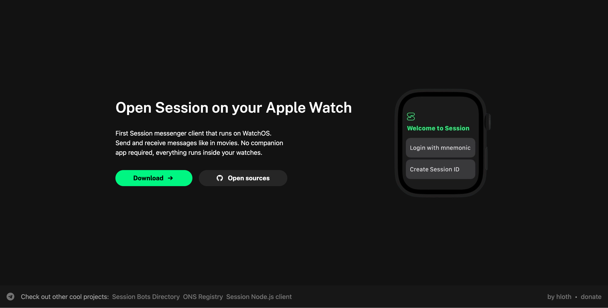
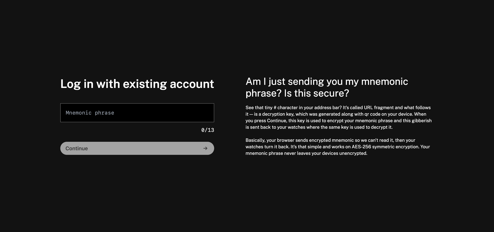

# Session watch OS client website

Website for [Session watch OS client](https://github.com/VityaSchel/session-watchos)

Used to sign in with mnemonic into the app. Mnemonic is encrypted with a key that is not sent to server.

## Usage

1. Clone repository
2. Run Redis database with `npm run db`
3. Run Next.js server with `npm run dev`

## Login flow

1. Make GET request to /api/start-login-flow, it will respond with JSON like `{"ok": true,"flowID": "URlf0dTn8"}`
2. Generate AES-256 key for encryption and store it in a local variable, it will be used later for decryption. Encode it in base64 as iv+key where iv is 16 bytes length and key is 32 bytes length
3. Grab that flowID and open /login/\[flowID\]#\[encryptionKey\] page. For example `/login/URlf0dTn8#123456789`
4. User will input their mnemonic, and it will be stored in Redis database encrypted with this key. Encryption is done clientside in browser, server only receives encrypted mnemonic and never receives key.
5. Periodically check /api/login-flow-result/\[flowID\], it will respond with JSON like `{"ok": true,"result": null}` meaning user has not yet inputted their mnemonic. Once result is string, decrypt it with the key and you've got what user inputted. **As soon as server responded with resulted encrypted string, this flow will be deleted and you won't be able to request results for the same flow again**